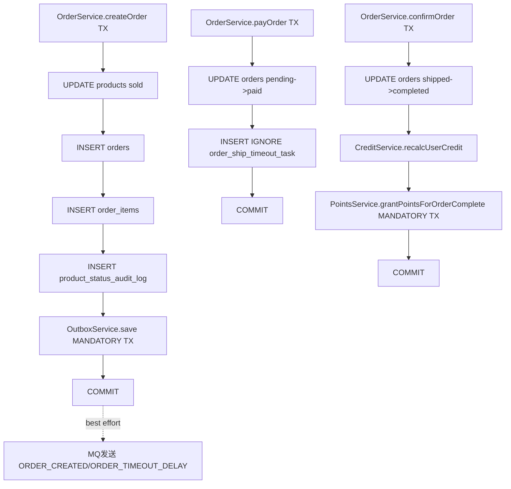
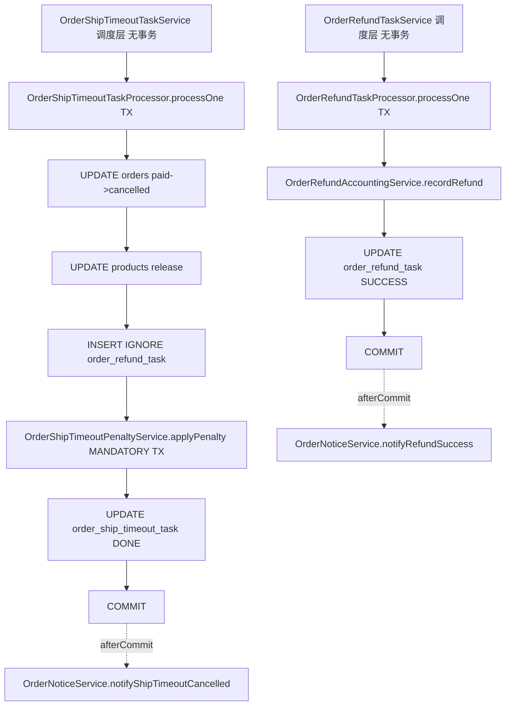

# Day17 P4-S1 事务边界清单 v1.0

- 日期：2026-02-24
- 范围：第一版仅覆盖两条关键链路  
  1) 订单主链路（下单 / 支付 / 取消 / 确认收货 / 支付回调）  
  2) 超时退款链路（超时关单任务 -> 退款任务）

---

## 1. 事务口径（本阶段统一规则）

1. **写链路必须有显式事务入口**：`@Transactional(rollbackFor = Exception.class)`。  
2. **读链路显式只读**：`@Transactional(readOnly = true)`，避免误写入。  
3. **Outbox 必须在业务事务内落库**：`Propagation.MANDATORY`。  
4. **批处理采用“外层调度 + 内层单条事务”**：避免大事务拖垮整批，失败单条可重试。  
5. **外部副作用后置**：通知/消息优先使用 `afterCommit`，避免“回滚后仍发送”。

---

## 2. 事务图谱（Mermaid）

### 2.1 订单主链路

### 2.2 超时退款链路

---

## 3. 跨表写入事务边界清单

| 链路 | 事务入口方法 | 主要写表 | 外部副作用 | 当前口径 |
|---|---|---|---|---|
| 下单 | `OrderServiceImpl.createOrder` | `products`、`orders`、`order_items`、`product_status_audit_logs`、`message_outbox` | MQ best-effort | 单事务保护（已显式） |
| 支付 | `OrderServiceImpl.payOrder` | `orders`、`order_ship_timeout_task` | 无 | 单事务保护（已显式） |
| 取消订单 | `OrderServiceImpl.cancelOrder` | `orders`、`products`、`users`、`user_credit_logs` | 无 | 单事务保护（已显式） |
| 确认收货 | `OrderServiceImpl.confirmOrder` | `orders`、`users`、`user_credit_logs`、`points_ledger` | MQ best-effort | 单事务保护（已显式） |
| 支付回调 | `OrderServiceImpl.handlePaymentCallback` | `orders`、`message_outbox`、`order_ship_timeout_task` | MQ best-effort | 单事务保护（已显式） |
| 超时关单任务 | `OrderShipTimeoutTaskProcessor.processOne` | `orders`、`products`、`order_refund_task`、`user_violations`、`users`、`user_credit_logs`、`order_ship_timeout_task` | 站内消息（afterCommit） | 单条事务保护（已显式） |
| 退款任务 | `OrderRefundTaskProcessor.processOne` | `user_wallets`、`wallet_transactions`、`order_refund_task` | 站内消息（afterCommit） | 单条事务保护（已显式） |

---

## 4. 风险点与本阶段处理

1. `safePublish(...)` 属于“非事务消息发送”，失败不回滚主交易。  
   - 本阶段处理：保留（已有 Outbox 兜底）；图谱中明确标注为 **best effort**。  
2. 任务调度层不加事务，避免整批大事务。  
   - 本阶段处理：保留；通过 Processor 单条事务保证一致性。  
3. Outbox/积分/处罚等跨域写入以前依赖“隐式加入外层事务”。  
   - 本阶段处理：关键方法改为 `MANDATORY`，强制必须在事务内调用。

---

## 5. DoD 对齐（P4-S1 第一版）

- [x] 两条关键链路事务边界已图谱化  
- [x] 跨表写入方法均有明确事务入口  
- [x] 读写事务口径已定义并落地关键方法标注  
- [x] 已提供可复现的异常回滚验证步骤（见执行复现文档）

---

（文件结束）
