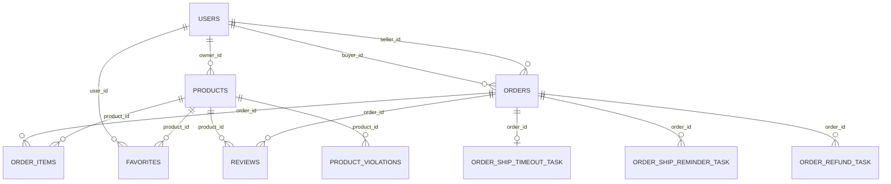

# Day17 P5-S4 数据库设计文档 v1.0

- 日期：2026-02-24  
- 对应范围：`Step P5-S4：文档冻结与团队可移交`  
- 数据来源：
  1. `C:\Users\kk\Desktop\_localhost__3_-2026_02_24_17_56_02-dump.sql`
  2. `day17回归/慢SQL与索引治理/Day17_P3_S3_索引脚本_v1.0.sql`
  3. `day17回归/幂等治理/Day17_P4_S2_唯一约束脚本_v1.0.sql`

---

## 1. 设计总览

Day17 后数据库设计可按 5 个域理解：

1. 用户与商品域：`users`、`products`、`favorites`、`reviews`  
2. 订单主链路域：`orders`、`order_items`  
3. 异步一致性域：`message_outbox`、`mq_consume_log`  
4. 超时与补偿任务域：`order_ship_timeout_task`、`order_ship_reminder_task`、`order_refund_task`  
5. 治理审计域：`product_report_ticket`、`product_violations`、`product_status_audit_log`

Day17 关键目标不是“重建模型”，而是把既有模型的 **索引、约束、幂等键、可追踪字段** 收口为可审计资产。

---

## 2. 命名与字段口径

## 2.1 时间字段口径

1. 业务主表优先采用 `create_time` / `update_time`。  
2. Outbox/消费日志保留历史命名 `created_at` / `updated_at`。  
3. 在实体层通过 MP 注解映射与自动填充统一写入口径（见 `BaseAuditEntity` 与 `AuditMetaObjectHandler`）。

## 2.2 软删除口径

1. `products.is_deleted`、`favorites.is_deleted`、`users.is_deleted` 等为软删除标记。  
2. 所有列表/查询 SQL 必须显式加软删条件（或由 MP 逻辑删除统一处理）。

## 2.3 状态字段口径

1. 订单：`pending | paid | shipped | completed | cancelled`  
2. 商品：`under_review | on_sale | off_shelf | sold`  
3. Outbox：`NEW | SENT | FAIL`  
4. 任务：`PENDING | RUNNING | SUCCESS | FAILED | DONE | CANCELLED`（按表定义）

---

## 3. 核心表结构说明（Day17重点）

## 3.1 用户与商品域

### `users`

- 主键：`id`  
- 唯一约束：`uk_users_username`、`uk_users_mobile`、`uk_users_email`  
- 关键字段：`credit_score`、`credit_level`、`status`、`is_seller`  
- 设计意图：身份唯一、信用治理、卖家资格判定。

### `products`

- 主键：`id`  
- 外键：`owner_id -> users.id`  
- 索引：`idx_products_owner`、`idx_products_status`、`idx_products_category`、全文索引 `ft_title_desc_ngram`  
- 关键约束：`chk_products_status_day16`（状态合法性）  
- Day17 关注点：状态迁移安全 + 审计对齐 + 列表分页索引命中。

### `favorites`

- 主键：`id`  
- 外键：`user_id -> users.id`、`product_id -> products.id`  
- 唯一约束：`uk_favorites_user_product`（收藏幂等）  
- 索引：`idx_favorites_user_time`、`idx_favorites_product`  
- Day17 关注点：MP CRUD 迁移样板 + 幂等插入/恢复语义。

### `reviews`

- 主键：`id`  
- 唯一约束：`uniq_order_role`（同一订单同一角色仅一条评价）  
- 索引：`idx_product_time`、`idx_seller_time`、`idx_buyer_time`  
- Day17 关注点：从手写 SQL 迁移简单查询到 MP，保留复杂聚合路径。

## 3.2 订单主链路域

### `orders`

- 主键：`id`  
- 唯一约束：`uk_orders_order_no`（业务主键）  
- 外键：`buyer_id -> users.id`、`seller_id -> users.id`  
- 索引：`idx_orders_buyer_status`、`idx_orders_seller_status`、`idx_orders_status_create_time`  
- 关键字段：`pay_time`、`ship_time`、`cancel_time`、`cancel_reason`、`update_time`  
- Day17 关注点：状态流转 CAS 更新、分页查询收口、事务链路一致性。

### `order_items`

- 主键：`id`  
- 外键：`order_id -> orders.id`（级联删除）、`product_id -> products.id`  
- 角色：订单快照明细，和订单主表同事务写入。

## 3.3 异步一致性域（Outbox）

### `message_outbox`

- 主键：`id`  
- 唯一约束：`uk_event_id`（事件幂等）  
- 索引：`idx_status_time`、`idx_outbox_status_retry_id`  
- 关键字段：`event_id`、`event_type`、`payload_json`、`retry_count`、`next_retry_time`
- Day17 关注点：
  1. 主事务内落库，保证“主链路成功后事件可追踪”；  
  2. 批量发送后批量回写，降低 DB 往返；  
  3. `listPending` 语义收口，限制 filesort 影响面。

### `mq_consume_log`

- 主键：`id`  
- 唯一约束：`uk_consumer_event`（消费端去重）  
- 索引：`idx_event`  
- Day17 关注点：消费侧幂等与重复消息无副作用。

## 3.4 超时与补偿任务域

### `order_ship_timeout_task`

- 主键：`id`  
- 唯一约束：`uk_ship_timeout_order_id`（每单一条超时任务）  
- 索引：`idx_ship_timeout_status_deadline`、`idx_ship_timeout_next_retry`  
- 角色：支付后超时未发货的主任务驱动。

### `order_ship_reminder_task`

- 主键：`id`  
- 唯一约束：`uk_order_level`（每单每档位一条提醒）  
- 索引：`idx_status_remind_time`、`idx_status_running_at`、`idx_seller_status`  
- 角色：H24/H6/H1 提醒任务，支持 RUNNING 卡死回收。

### `order_refund_task`

- 主键：`id`  
- 唯一约束：`uk_refund_order_type`、`uk_refund_idempotency`  
- 索引：`idx_refund_status_time`、`idx_refund_next_retry`  
- 角色：超时退款/售后退款补偿任务，支持 CAS 状态推进。

## 3.5 治理审计域

### `product_report_ticket`

- 主键：`id`  
- 唯一约束：`uk_ticket_no`  
- 检查约束：`chk_prt_action_day16`、`chk_prt_status_day16`  
- 角色：举报工单流转。

### `product_violations`

- 主键：`id`  
- 外键：`product_id -> products.id`  
- 索引：`idx_pv_product_status_id`（Day17 新增）  
- 角色：违规记录与处罚证据。

### `product_status_audit_log`

- 主键：`id`  
- 索引：`idx_psal_product_time`、`idx_psal_operator_time`、`idx_psal_action_time`  
- 角色：商品状态迁移审计证据链。

---

## 4. 表关系图（核心主链路）

---

## 5. 索引与幂等约束冻结清单（Day17）

## 5.1 Day17 新增/强化索引

| 表 | 索引名 | 列 | 目标 |
|---|---|---|---|
| `addresses` | `idx_addr_user_default_updated` | `user_id,is_default,updated_at,id` | 地址列表分页+默认地址查询 |
| `product_violations` | `idx_pv_product_status_id` | `product_id,status,id` | 违规记录分页查询 |
| `message_outbox` | `idx_outbox_status_retry_id` | `status,next_retry_time,id` | Outbox 拉取待发送 |

脚本来源：`day17回归/慢SQL与索引治理/Day17_P3_S3_索引脚本_v1.0.sql`

## 5.2 核心幂等唯一键

| 表 | 唯一键 | 幂等语义 |
|---|---|---|
| `orders` | `uk_orders_order_no` | 下单请求唯一 |
| `message_outbox` | `uk_event_id` | 事件唯一 |
| `mq_consume_log` | `uk_consumer_event` | 消费去重 |
| `order_ship_timeout_task` | `uk_ship_timeout_order_id` | 每单一条超时任务 |
| `order_ship_reminder_task` | `uk_order_level` | 每单每档提醒唯一 |
| `order_refund_task` | `uk_refund_order_type` / `uk_refund_idempotency` | 退款任务防重 |
| `favorites` | `uk_favorites_user_product` | 收藏防重 |
| `reviews` | `uniq_order_role` | 评价防重 |

脚本来源：`day17回归/幂等治理/Day17_P4_S2_唯一约束脚本_v1.0.sql`

---

## 6. 数据一致性策略（数据库层）

1. **主链路事务内落 Outbox**：业务写与事件写同提交。  
2. **任务状态推进走 CAS**：`WHERE id=? AND status=?`，避免并发覆盖。  
3. **重试任务保留 next_retry_time**：显式记录重试节奏。  
4. **消费端强制幂等日志**：重复消息只命中日志，不重复副作用。  
5. **关键表唯一键前置防重**：失败走幂等命中分支，不依赖应用层“猜测”。

---

## 7. 演进约束（给后续开发）

1. 新增列表查询必须先给索引方案，再合入 SQL。  
2. 新增“可重复触发”的业务动作必须先定义幂等键和唯一约束。  
3. 新增任务表必须包含：`status`、`retry_count`、`next_retry_time`、`create_time`、`update_time`。  
4. 任何跨表写入链路都需标注事务边界与异常回滚语义。  
5. 涉及消息可靠性时，优先复用 Outbox，不引入“主逻辑直发 MQ”旁路。

---

（文件结束）
