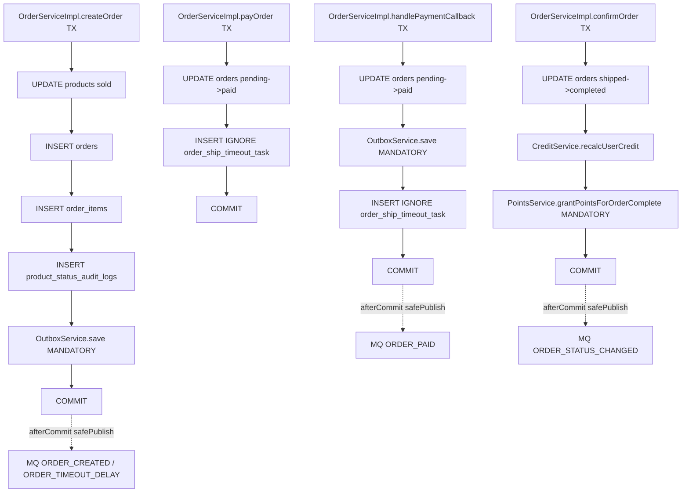

# Day18 P1-S1 事务边界清单 v2

- 日期：2026-02-25  
- 对应阶段：`Step P1-S1：事务边界复核与口径统一`  
- 范围：订单主链路 + 任务链路 + Outbox 边界收口。

---

## 1. 统一口径（P1-S1 冻结）

1. 写链路事务入口统一：`@Transactional(rollbackFor = Exception.class)`。  
2. 只读查询统一：`@Transactional(readOnly = true)`。  
3. 跨域内聚写入统一：`Propagation.MANDATORY`（Outbox/积分/处罚等只能在外层事务内调用）。  
4. 调度层统一“无事务编排 + 单条事务处理器”模式，避免批次大事务。  
5. 外部副作用统一后置：通知/MQ 优先 `afterCommit`，避免“回滚后仍发送”。

---

## 2. 事务图谱（v2）

### 2.1 订单主链路（同步事务 + 事务后副作用）



### 2.2 任务链路（调度层无事务 + 单条事务处理）

```mermaid
flowchart TD
  A1[@Scheduled Job] --> B1[TaskService.processDueTasks 无事务]
  B1 --> C1[Processor.processOne TX]

  C1 --> D1[OrderShipTimeoutTaskProcessor]
  D1 --> E1[UPDATE orders/products]
  E1 --> F1[INSERT IGNORE order_refund_task]
  F1 --> G1[OrderShipTimeoutPenaltyService.applyPenalty MANDATORY]
  G1 --> H1[UPDATE task DONE/RETRY/CANCELLED]
  H1 --> I1[COMMIT]
  I1 -.afterCommit.-> J1[notifyShipTimeoutCancelled]

  C1 --> D2[OrderRefundTaskProcessor]
  D2 --> E2[recordRefund accounting]
  E2 --> F2[UPDATE refund_task SUCCESS/FAILED]
  F2 --> G2[COMMIT]
  G2 -.afterCommit.-> H2[notifyRefundSuccess]
```

---

## 3. 方法级事务边界清单（v2）

| 链路 | 方法 | 事务声明 | 关键写入 | 副作用时机 | 结论 |
|---|---|---|---|---|---|
| 订单查询 | `buy/getSellOrder/getOrderDetail` | `readOnly=true` | 无写入 | 无 | 读事务口径一致 |
| 卖家发货 | `OrderServiceImpl.shipOrder` | `rollbackFor=Exception` | `orders` | `safePublish` afterCommit | 符合统一口径 |
| 确认收货 | `OrderServiceImpl.confirmOrder` | `rollbackFor=Exception` | `orders`、信用/积分相关表 | `safePublish` afterCommit | 符合统一口径 |
| 下单 | `OrderServiceImpl.createOrder` | `rollbackFor=Exception` | `products`、`orders`、`order_items`、`product_status_audit_logs`、`message_outbox` | `safePublish` afterCommit | 符合统一口径 |
| 支付 | `OrderServiceImpl.payOrder` | `rollbackFor=Exception` | `orders`、`order_ship_timeout_task` | 无 | 符合统一口径 |
| 取消 | `OrderServiceImpl.cancelOrder` | `rollbackFor=Exception` | `orders`、`products`、信用相关表 | 无 | 符合统一口径 |
| 支付回调 | `OrderServiceImpl.handlePaymentCallback` | `rollbackFor=Exception` | `orders`、`message_outbox`、`order_ship_timeout_task` | `safePublish` afterCommit | 符合统一口径 |
| 超时关单（单条） | `OrderShipTimeoutTaskProcessor.processOne` | `rollbackFor=Exception` | `orders`、`products`、`order_refund_task`、处罚相关表、`order_ship_timeout_task` | `registerAfterCommit` | 符合统一口径 |
| 退款任务（单条） | `OrderRefundTaskProcessor.processOne` | `rollbackFor=Exception` | `order_refund_task`、记账相关表 | `registerAfterCommit` | 符合统一口径 |
| Outbox 入库 | `OutboxServiceImpl.save` | `MANDATORY + rollbackFor` | `message_outbox` | 无 | 跨域写入边界清晰 |
| 积分发放 | `PointsServiceImpl.grantPointsForOrderComplete` | `MANDATORY + rollbackFor` | `points_ledger` | 无 | 跨域写入边界清晰 |
| 超时处罚 | `OrderShipTimeoutPenaltyServiceImpl.applyPenalty` | `MANDATORY + rollbackFor` | `user_violations`、信用相关表 | 无 | 跨域写入边界清晰 |
| Outbox 状态回写 | `OutboxBatchStatusService.flushPublishResult` | `rollbackFor=Exception` | `message_outbox` | 无 | 批量回写事务明确 |
| 调度层 | `OrderShipTimeoutServiceImpl/OrderRefundTaskServiceImpl/OrderShipReminderTaskServiceImpl` | 无事务（设计） | 无直接事务写 | 无 | 设计符合“调度与事务解耦” |
| 发货提醒单条 | `OrderShipReminderTaskProcessor.processOne` | 无 `@Transactional`（设计） | `order_ship_reminder_task` 状态推进 | 发送站内消息后再写状态 | 需明确为“外部 I/O 优先 + 幂等兜底” |

---

## 4. 统一口径复核结论

## 4.1 已收口项

1. 订单主链路写操作均显式 `rollbackFor = Exception.class`。  
2. 订单主链路读操作均显式 `readOnly = true`。  
3. Outbox/积分/处罚三类跨域写入均使用 `MANDATORY`。  
4. 关键外部副作用均存在 `afterCommit` 防线（MQ/通知）。

## 4.2 需在评审中持续关注项

1. 发货提醒单条处理器未使用 `@Transactional`，当前依赖幂等键 + CAS 状态推进控制一致性。  
2. `safePublish` 为 best-effort，发送失败不回滚主流程，需依赖 Outbox/任务兜底。  
3. 调度层无事务是设计选择，后续新增逻辑不得在调度层直接写跨表业务数据。

---

## 5. 代码证据索引（关键定位）

1. `demo-service/src/main/java/com/demo/service/serviceimpl/OrderServiceImpl.java`  
2. `demo-service/src/main/java/com/demo/service/serviceimpl/OrderShipTimeoutTaskProcessor.java`  
3. `demo-service/src/main/java/com/demo/service/serviceimpl/OrderRefundTaskProcessor.java`  
4. `demo-service/src/main/java/com/demo/service/serviceimpl/OutboxServiceImpl.java`  
5. `demo-service/src/main/java/com/demo/service/serviceimpl/OutboxBatchStatusService.java`  
6. `demo-service/src/main/java/com/demo/service/serviceimpl/PointsServiceImpl.java`  
7. `demo-service/src/main/java/com/demo/service/serviceimpl/OrderShipTimeoutPenaltyServiceImpl.java`  
8. `demo-service/src/main/java/com/demo/service/serviceimpl/OrderShipTimeoutServiceImpl.java`  
9. `demo-service/src/main/java/com/demo/service/serviceimpl/OrderRefundTaskServiceImpl.java`  
10. `demo-service/src/main/java/com/demo/service/serviceimpl/OrderShipReminderTaskServiceImpl.java`  
11. `demo-service/src/main/java/com/demo/service/serviceimpl/OrderShipReminderTaskProcessor.java`

---

## 6. DoD 对照（P1-S1）

- [x] 关键跨表写链路全部可定位事务边界。  
- [x] `rollbackFor/readOnly/afterCommit` 口径已形成统一规则并完成关键链路复核。  
- [x] 输出“事务边界图 + 方法级边界清单”。  
- [x] 输出可复现文档与执行记录（见关联文档）。

---

（文件结束）
